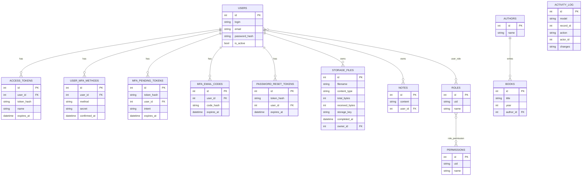

# Schéma de la base

Généré depuis les modèles réels (`forge/security/models.py`,
`forge/audit.py`, `forge/storage/models.py`,
`example_app/models/*.py`) — à régénérer si les modèles changent,
pas maintenu à la main.

Notes :
- `ACTIVITY_LOG.actor_id` n'a **pas** de contrainte FK — volontaire,
  pour garder l'historique d'audit même si l'utilisateur qui a fait
  l'action est supprimé ensuite.
- `user_role` et `role_permission` sont les tables pivot des relations
  N-N (RBAC) — pas de ligne propre dans ce schéma, juste les deux
  colonnes de clé étrangère composant la clé primaire.
- `AUTHORS`/`BOOKS`/`NOTES` sont l'app d'exemple (`example_app/`), pas
  le framework — gardées ici pour la vue d'ensemble complète.
